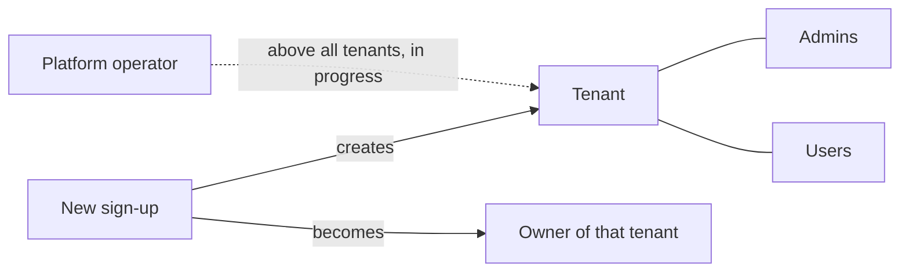

# Users Overview

Every FrankPHP app is multi-tenant from day one. This section explains how people get into your app, which tenant they belong to, what their role lets them do, and how to adapt those rules to your business.

---

## The three ideas you need

- **Tenant:** one customer account in your app, such as a business, a team or a personal workspace. Tenant data is kept separate, and every tenant route includes the tenant id (`/tenant/{tenant_id}/...`).
- **User:** a person who logs in. Every user belongs to exactly one tenant.
- **Role:** what a user can do inside their tenant: `owner`, `admin`, `user`, or the site-operator role `platform`.

<Note>
*Changed in v2.1.0:* every sign-up now creates **its own tenant** and the person signing up becomes its **owner**. Earlier versions added every sign-up to tenant 1 as a regular user.
</Note>

---

## What's in this section

<CardGroup cols={2}>
  <Card title="New User Sign-up Flow" icon="user-plus" href="/users/signup-flow">
    The two-step sign-up with email verification, and what happens at each step.
  </Card>
  <Card title="Tenants, Ownership & Roles" icon="building" href="/users/tenants-and-roles">
    How new tenants are named, how slugs work, and what each role means.
  </Card>
  <Card title="Terms & Conditions Acceptance" icon="file-signature" href="/users/terms-acceptance">
    Opt-in terms acceptance, recorded with a timestamp and version.
  </Card>
  <Card title="Customising Sign-up" icon="sliders" href="/users/customising-signup">
    Change which tenant new users join, and restyle the sign-up views.
  </Card>
  <Card title="Upgrading to 2.1.0" icon="arrow-up-right-dots" href="/users/upgrading-to-2-1-0">
    The steps for existing installs, including the database migration.
  </Card>
</CardGroup>

---

## Not available yet

This section will grow as FrankPHP's **privilege framework** is built. The following are planned and are **not** part of FrankPHP today. Don't build on them yet.

- **Finer-grained privileges:** per-role permissions beyond the current `owner` / `admin` / `user` checks.
- **Cross-tenant `platform` access:** the `platform` role exists, but a platform user still can't open another tenant's pages.
- **Invite a user / join an existing tenant:** today, two colleagues who sign up separately get two separate tenants.
- **Single sign-on (SSO).**
- **Re-accepting terms** when your terms version changes.
- **A consent audit log** that keeps a history of every terms acceptance.

---

Introduced in [v2.1.0](/changelog#30-september-2026). See the changelog for the full release notes.
