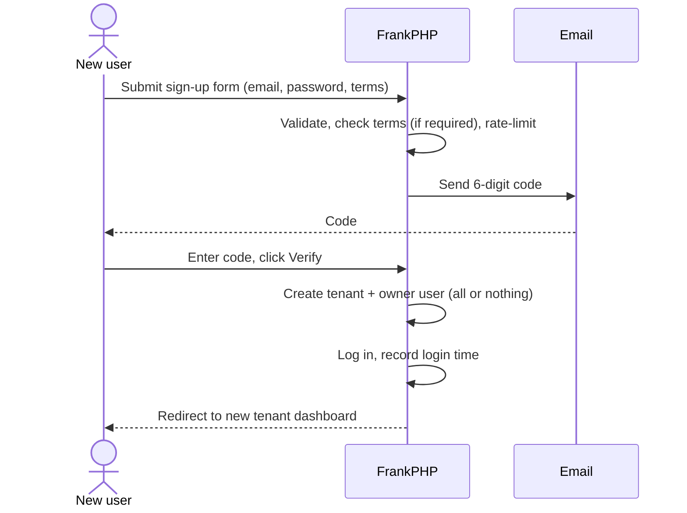

# New User Sign-up Flow

A new user signs up in two steps. The second step creates their account **and** their own tenant.

---

## The steps

<Steps>
  <Step title="Sign-up form">
    At `/signup` the user enters their email, a password and a password confirmation. If your app has turned on [Terms & Conditions acceptance](/users/terms-acceptance), there's also a Terms checkbox.
  </Step>
  <Step title="Email verification">
    FrankPHP emails a **6-digit code**, valid for **15 minutes**. The user enters it at `/signup/verify` and clicks **Verify & Create Account**.
  </Step>
  <Step title="Account created">
    FrankPHP creates a new tenant for the user, creates the user as that tenant's **owner**, and logs them straight in.
  </Step>
  <Step title="Dashboard">
    The user lands on their new tenant's dashboard.
  </Step>
</Steps>

<Note>
*Changed in v2.1.0:* step 3 used to add the user to tenant 1 as a regular `user`. It now creates a new tenant with the user as its `owner`. See [Tenants, Ownership & Roles](/users/tenants-and-roles) for how the tenant is named.
</Note>

---

## Good to know

- **No email probing.** If the email is already registered, the form still says a code was sent. This stops anyone from using the form to find out which emails have accounts.
- **Rate limiting.** Sign-up requests are limited per IP address, to 5 per hour by default.
- **All or nothing.** The tenant and the user are created together. If anything fails, neither is created and the user sees *"Account creation failed. Please try again."*
- **Site-owner alerts.** The address in `MAIL_SITE_ADMIN` gets an email when a code is requested and another when an account is created. The second email names the new tenant. See [Getting Email Up and Running](/getting-started/getting-email-up-and-running).
- **Last login is recorded.** The automatic login after sign-up counts as the user's first login, so they don't show as "never logged in" on the User Management dashboard.

---

## Next

- [Tenants, Ownership & Roles](/users/tenants-and-roles): how the new tenant is named and what `owner` means.
- [Customising Sign-up](/users/customising-signup): send new users somewhere other than a new tenant.

Changed in [v2.1.0](/changelog#30-september-2026).
